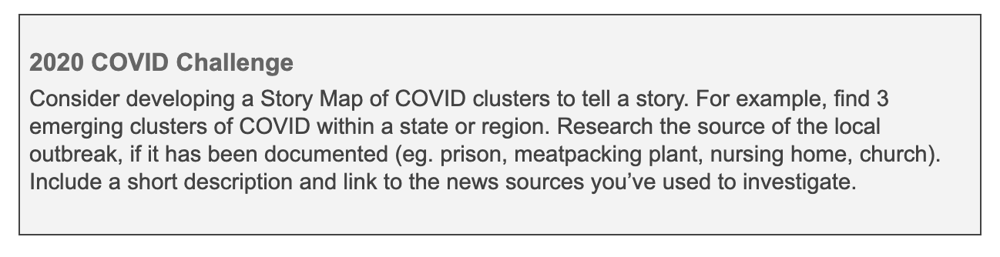
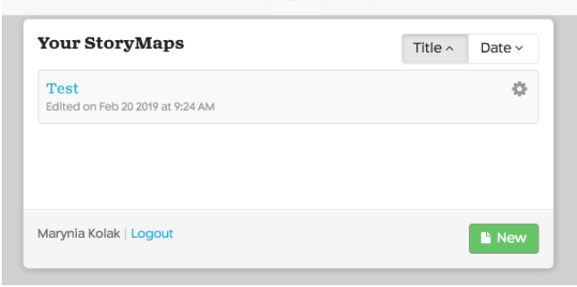
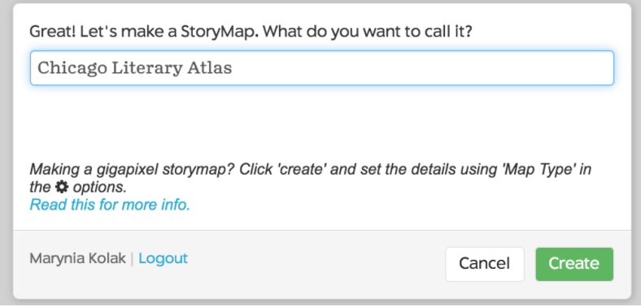
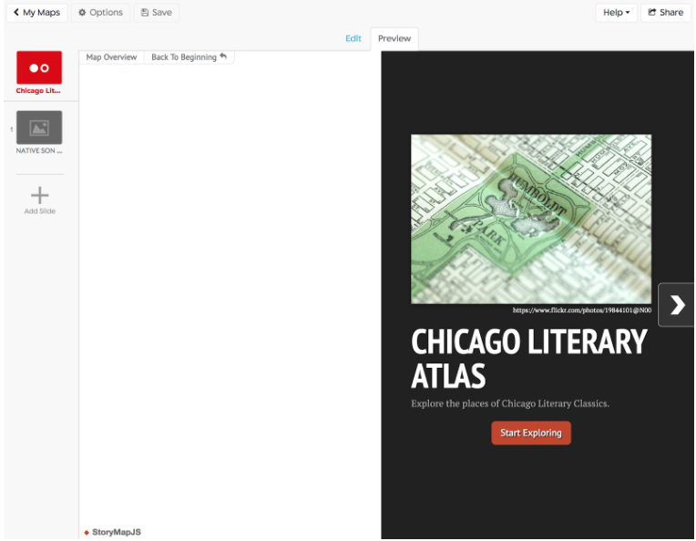
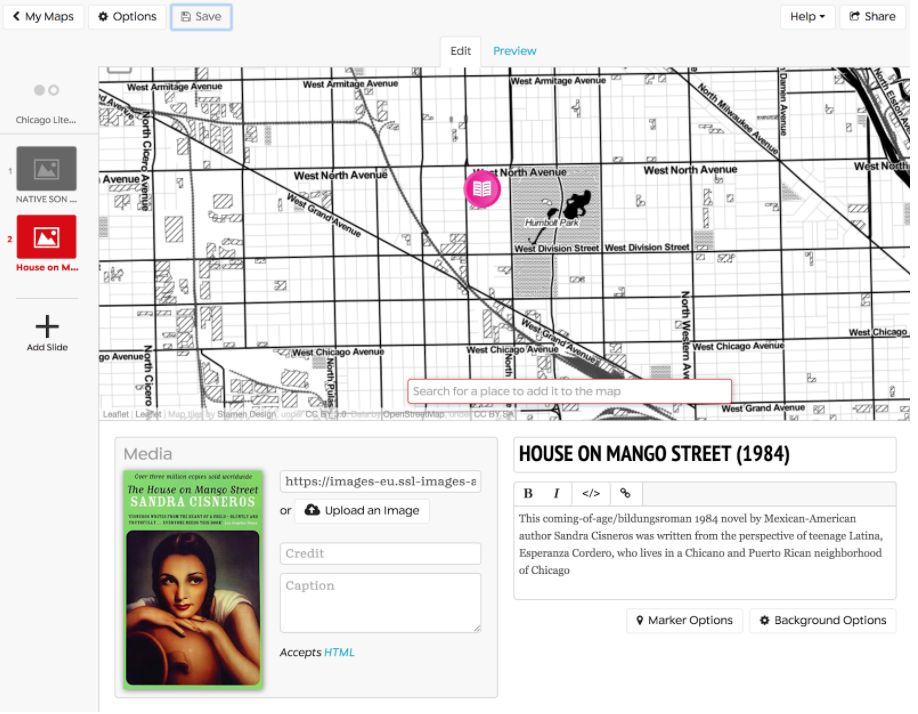

# Lab 6. StoryTelling Maps

```{r setup, include=FALSE}
knitr::opts_chunk$set(echo = TRUE)
```

## Overview

### Defining Storytelling Maps

Narrative Mapping or Storytelling is an aspect of geovisual analytics designed for interaction and the benefit of the user/individual experiencing the map. From the Robinson (2017):^[ Robinson, A. (2017). Geovisual Analytics. The Geographic Information Science & Technology Body of Knowledge (3rd Quarter 2017 Edition), John P. Wilson (ed.). DOI: <ins>10.22224/gistbok/2017.3.6</ins>]

> “*Systems for geovisual analytics typically
support a high degree of interactivity (Roth,
2013), and this interactivity is directed by
the end-user (see <ins>User Interface & User
Experience</ins>). Interface controls are
normally provided for both the representation
methods that are applied to geographic data as well as computational techniques that may be used to extract patterns from complex datasets.* <br/> 

> *A focus on interactivity in geovisual analytics is intended to support iterative engagement by users to evaluate and refine what they are seeing, and therefore enable deductive, inductive, and abductive forms of reasoning (Gahegan, 2005). Interactivity was a central motivating factor behind the rise of geovisualization as a domain, the most direct predecessor for what today is known as geovisual analytics. Early progress on geovisualization featured the development of novel methods of map interactivity that allowed users to dynamically modify the visual display of geographic information.* <br />  

> *Today, in geovisual analytics, interactivity can include the ability to modify visual representations as well as underlying computational methods and tools for supporting storytelling (Van Ho, Lundblad, Astrom, & Jern, 2012).*” <br />  

ESRI recommends the five following principles when developing a storytelling map:^[[https://storymaps.arcgis.com/en/five-principles/](https://storymaps.arcgis.com/en/five-principles/)]

1. Connect with your audience
2. Lure people in
3. Choose the best user experience
4. Make easy-to-read maps
5. Strive for simplicity

We will be making an interactive storymap using the KnightLab opensource tool, *StoryMapJS*. StoryMapJS is a free tool to “help you tell stories on the web that highlight the locations of a series of events.” <br />  

First, go to the site and explore the gallery for ideas: [https://storymap.knightlab.com/](https://storymap.knightlab.com/) <br />  

What sort of media and mapping is best suited for this tool?

## Research Question

## Environment Setup
Let's make a storymap!<br />  

First, choose three location-based events related to some larger concept or theme. For example, it could be a resource map of places that would be useful for a user, or a historical map showing change and progression in movement over time. <br />  

Collect the following for each (minimum of 3 events/places):

* Title/Name of Event/Place
* Location of  Event/Place
* Short Description of  Event/Place
* Photo and/or Video of  Event/Place

Additionally, there should be some temporal sequence to the events, so that each progresses from one to the next in logical order.

```{r echo=FALSE}

```

For this example, I’ll use start a Chicago Literary Atlas with the following classics, using information from Wikipedia to start. I chose approximate addresses for locations: <br />  

1. Title: Native Son (1940)
+ Location: 438 E 31st St, Chicago, IL 60616
+ Description: This classic novel by Richard Wright, published in 1940, tells the story of 20-year-old Bigger Thomas, an African American youth living on Chicago's South Side in the 1930s.
+ Image:[https://upload.wikimedia.org/wikipedia/en/0/0f/NativeSon.JPG](https://upload.wikimedia.org/wikipedia/en/0/0f/NativeSon.JPG)
2. Title: House on Mango Street (1984)
+ Location: 3320 W Hirsch St Chicago, IL 60641
+ Description: This coming-of-age/bildungsroman 1984 novel by Mexican-American author Sandra Cisneros was written from the perspective of teenage Latina, Esperanza Cordero, who lives in a Chicano and Puerto Rican neighborhood of Chicago.
+ Image: [https://images-eu.ssl-images-amazon.com/images/I/51UG2cpemrL.jpg](https://images-eu.ssl-images-amazon.com/images/I/51UG2cpemrL.jpg)
3. Title: Man With the Golden Arm (1949)
+ Location: 1150 N Damen Ave, Chicago, IL 60622
+ Description: This novel by Nelson Algren details the trials and hardships of illicit card dealer "Frankie Machine", along with an assortment of colorful characters, on Chicago's Near Northwest Side.
+ Image: [https://upload.wikimedia.org/wikipedia/en/f/fa/ManWithTheGoldenArm.JPG](https://upload.wikimedia.org/wikipedia/en/f/fa/ManWithTheGoldenArm.JPG) <br />  

You also need information for your title slide/landing page:
* Title: Chicago Literary Atlas
* Description: Explore the places of Chicago Literary Classics.
* Image: [https://www.flickr.com/photos/19844101@N00/2523984571](https://www.flickr.com/photos/19844101@N00/2523984571)
(found from Creative Commons search)

## Start Mapping

Click the “Start your Map” button on the main page of StoryMap. Sign in using a Google account. Click on the “New” Green button once logged in.

```{r echo=FALSE}

```

Give your StoryMap a name.

```{r echo=FALSE}

```

Enter the information for your title slide. You can change the background color or upload an image there, too (here it’s -> black). Following are the Edit and Preview tabs, respectively.

```{r echo=FALSE}
knitr::include_graphics('6-3.png')
```
```{r echo=FALSE}

```

Next, add a new slide and add your information. Search for and add the place/address you’ve indicated. You can also find an icon image to update to the default. I searched for a free/open book icon, and used the link to add under “Marker Options.”

```{r echo=FALSE}
knitr::include_graphics('6-5.png')
```

Repeat for your next event/place..

```{r echo=FALSE}

```

Finish your last event. Click “Save” at the top. When you’re ready to view, you can go to the title slide and click “Preview.” Note that the blank space on the left side of your slide is now populated by the extent of your map! This map, shown here, can be viewed [at this link](https://uploads.knightlab.com/storymapjs/c2bb7ebb0a48725759d89613f48b7b2c/chicago-literary-atlas/index.html).

```{r echo=FALSE}
knitr::include_graphics('6-7.png')
```

To view the map as its own URL, click the “Share” link at the top, and navigate to the link shown. <br />  

If you’d like to try a different map background, go to “Options” on the top left side, and switch the basemap shown. <br />  

```{r echo=FALSE}
knitr::include_graphics('6-8.png')
```