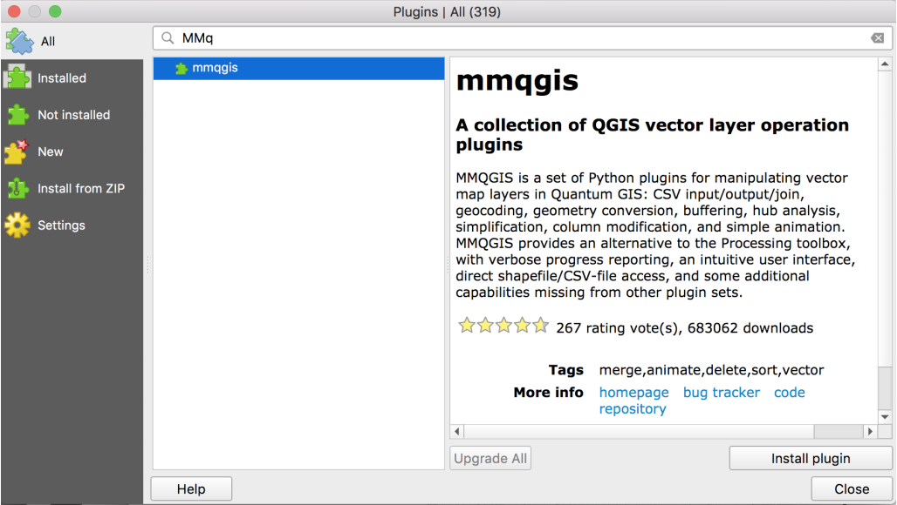

# Lab 1. Intro to Spatial Data

## The bolded sentences need to be made more general, as they are specific to a particular version of the software

## Overview

In this introduction to spatial data, you’ll learn about the different types of spatial data.

Objectives for this practical: 

* Get familiar with vector data
* Convert a CSV to spatial data format
* Overlay vector data in GIS system
* Inspect and update projection for spatial data 
* Create simple buffers
* Make a simple map using QGIS

## Research Question

## Environment Setup

For this lab, we will be working with QGIS. Ensure you’ve properly downloaded the
software and are able to successfully open. 

### Plugin

You will also need to install plugin MMQGIS. MMQGIS includes a buffer calculation tool useful in our course.

To install, go to the “Plugins” tab, click on the plugin management option, search by 
name, and install.

```{r echo=FALSE}

```

### Basemap

Next, we want to confirm that we have basemap library available to us. 
**In the most
updated version of QGIS, you should have a “Web” option in the main tab. Go to Web ->
QuickMapServices -> OSM and select a basemap, like “OSM Standard.”**

**On older versions of QGIS that do not include basemaps, you will also need to install the
OpenLayer plugin. The OpenLayer plugin includes multiple basemap layers to provide
context for our maps.**

If you have difficulty with either basemap options above, troubleshoot online. Use the version of
your QGIS and “add basemap” keywords as your search terms.

### File Management
Finally, you will want to establish and follow a file management plan. Create and use a
new folder that will hold data and production files for this exercise.

## Download Data
First, we need to download the required data from the Chicago Data Portal. To get to the Chicago Data Portal online, search online the appropriate keywords terms. When
inside the portal website, search the terms below. You will then find the “export” option
within each dataset to export the data in the required format.

* Produce Carts (CSV Format)
* Farmers Markets (CSV Format)
* Community Areas (Shapefile Format)

Open and inspect the CSV files. Identify latitude and longitude columns, if available.

## Transform Data
Next, we will transfrom the CSV files into a spatial data format.

* Open QGIS and Start a new project.
* Confirm the standard projection, EPSG:4326, is loaded in project space. We use
this standard projection because projection data was not available on the portal for
CSV formats, but a lat/long column field was. EPSG:4326 is the identifier for
WGS84, a standard coordinate frame for the Earth. If you’re not sure about your
projection, this is a great option to start with. Google Maps uses this datum. 
* **Click on “Layer/Add Layer/ Add Delimited Text Layer”**
* **Browse for the produce cart CSV. Click CSV button. Update x (longitude) and y
(latitude) field. Click the spatial index button. Click OK.**
* Add basemap layer to ensure the points are plotting correctly. (Use what you
learned about your version of QGIS and available basemap options in the
Environment Setup portion of the lab.) Y**ou may need to drag the basemap layer
under the points in the Layer Panel. If the Layer Panel isn’t visible, click on
“View/ Panels/ Layer Panel”**
* **Right-click the point layer in the Layer Panel, and click “Save as Layer.” Give the
point shapefile a new name, and save.**
* Repeat for next CSV file.

## Set New Project Space

While we found a projection that is correct for our data, we can’t easily create meaningful
buffers in the current form. The projection we are using is in degrees, and we would like to
calculate buffer distance using something more easy to digest, like feet or miles. To do
this, we’ll start a new environment. 

* Close your QGIS project. (Saving is optional but not necessary, as you’ve already
saved your new data files.)
* Open a new QGIS project. Click on the EPSG:4326 reference in the bottom right
corner. **Click “Enable ‘on the fly’ CRS transformation.” Search for “Illinois” and
look for a projection that uses feet. For example, NAD83(NSR2S2007) / Illinois
East (ftUS) works well. Click OK.**

We now have a projection that preserves distance, and any new file we load will automatically be transformed into that projection. This is a great function! 

## Style Layers
Now, we will style the individual layers

* **Load Produce Cart and Farmers Market Shapefiles by clicking on the line icon in
the left toolbar (above the checkerboard icon). In QGIS if you are ever unsure
what an icon is, hover for a few seconds and its label will pop up.**
* Practice inspection using different zoom levels, adding a basemap layer, etc.
Rearrange as needed in the layer panel. 
* **To style, double-click on a layer in the Layer Panel. In the Style tab, you can
update the color and transparency in the default window. To update size and
border color, click on “Simple marker.” Change the produce carts to an emerald
green, size 3 marker, with a dark grey border. Change the farmers markets to a
bright orange, size 3 marker, with a dark grey border.**
* In the General tab of layer properties, change the Layer Name to “Produce Carts”
and “Farmers Markets” accordingly. 

## Calculate and Style Buffers

In this step we create buffers for each point file. First we need to consider what the
reasonable size of the buffers are. The sizes should be based on the hypothesized coverage. Here, we assume that produce carts have a smaller coverage area than farmers markets because they sell less produce and are tailored for a different population “on the move.” We’ll use a
walkable 1-mile buffer for farmers markets, and a half-mile radius for produce carts. You
should always provide some evidence or justification for buffers used.

* **Open the buffer tool by clicking on “MMQGIS / Create/ Create Buffer”**
* Select the layer, and type in the appropriate radius in miles.
* **Use the browse button to navigate to your folder, and save as
“ProduceCarts_HalfMi.shp” and “FarmersMarkets_1Mi.shp” accordingly. Click OK.**
* The buffer will be added to the project space upon calculation. Rearrange your
layers so that buffers are under their appropriate features, and that produce carts
overlay farmers markets.
* Style the buffers: the farmers markets should be a light orange with no outline, and
moderate transparency, and the produce carts a light green with no outline.
* Label the produce cart buffer, “1/2 mile buffer.” Label the farmers market buffer,
“1 mile buffer.”

## Add labeled community areas
Next, we label the community areas for context.

* Add the community area shapefile to your map.
* Rearrange in layer panel so it is under everything else.
* **In the “Simple fill” section of Style (in Layer Properties), change the fill to 
transparent. Use a solid, dark grey, 0.5 border width for styling.**
* **In the Labels panel, switch to “Show labels for this layer.” Label with
“community” – the column that holds names for our areas. In the same section,
change the font to Helvetica Neue, Thin Italic Style, Size 8 pts.**
* Inspect and rearrange all elements until satisfied. 

## Compose a Map

Let's make the map!

* First, adjust the screen size of your QGIS workspace window until you’re satisifed
with how the map is situated. You will need to re-zoom accordingly. In QGIS, the
size of this window is important as it can serve as a limitation, if not situated
perfectly, when composing the Map.
* **Under the Project tab, click on New Map Composer. Give a name to your new
map.**
* **In the Map Composer, we will stick with a landscape setting. To change page
orientation or size for future purposes, click on the “Composition” tab.**
* **On the left toolbar, click a paper scroll icon (above the image icon) to add your
map. Move to the right side of your page, and resize accordingly.**
* **If your map is zoomed out too much: Under Item Properties, click on “Set to map
canvas extent.” This should resize the map according to how you set up the map
window. You may need to go back to the QGIS workspace to resize, and then
update further in the Map Composer, a few times. This is not a great feature of
QGIS.**
* **Add a title to the map. Click on the text icon on the left toolbar, and type in
“Chicago Alternative Food Map.” Change the font to Helvetica Neue, Bold, Size
28. Add a newline between Chicago, Alternative, and Food Map so they appear on
different lines. Move to upper left side of your Map.**
* **Add a Legend. Under Fonts, change to Helvetica Neue, Medium, Size 11. For
Item Font, change to Helvetica Neue, Light, Size 10.**
* **Add a scalebar. Meters is okay as a default. Under Fonts, change to Helvetica
Neue, Light, Size 8.**
* **Add a source. Using the text icon, add: “Created by [your name] 2018. Data from
the Chicago Data Portal.” Change the font to Helvetica Neue, Light, Size 10.**
* Rearrange all objects until you are satisfied.
* Save as PNG file.

```{r echo=FALSE}
knitr::include_graphics('1-3.png')
```

Figure 1: Final Map of Alternative Food in Chicago.