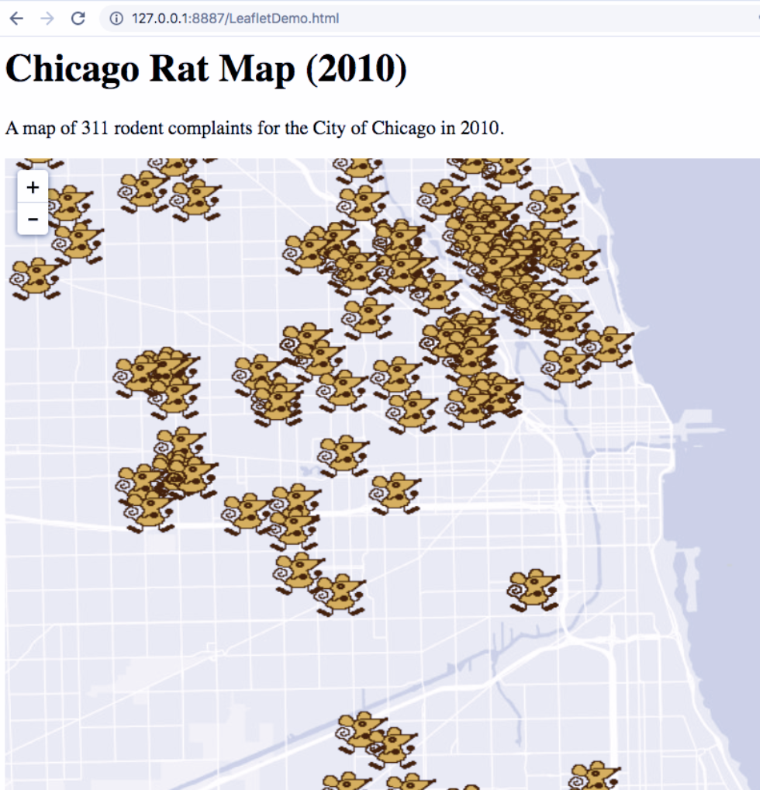
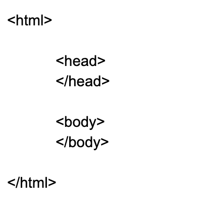
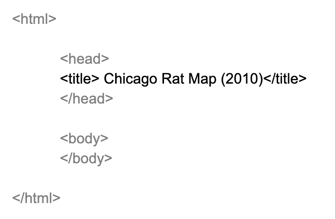
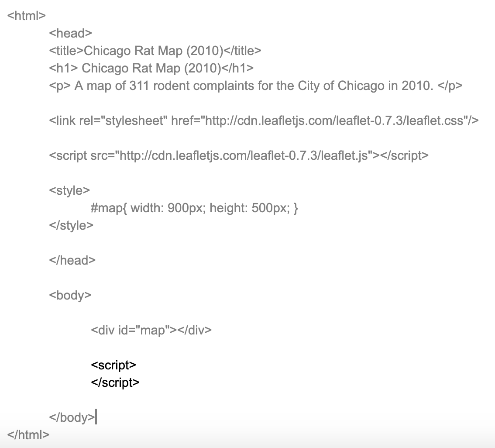
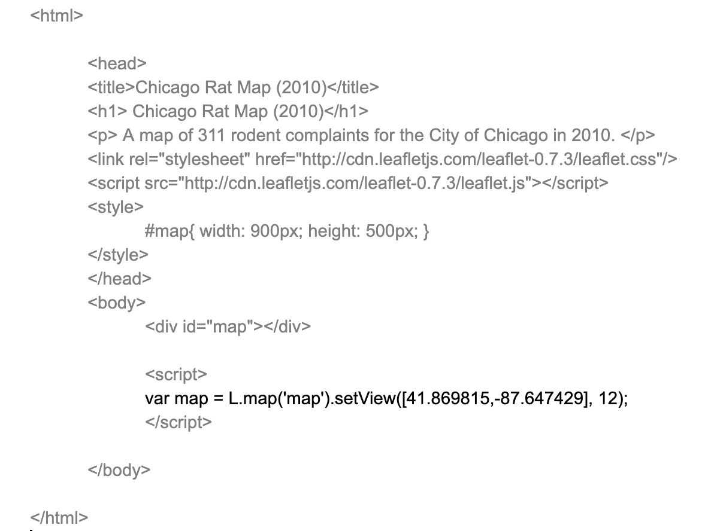

# Lab 10. Making a Simple Leaflet Web Map

_Sources: Leaflet Demo Documentation; MapTime Boston_
## Overview

### Chicago Rat Map (2010)
A map of 311 rodent complaints for the City of Chicago in 2010. <br />  

```{r echo=FALSE}
knitr::include_graphics('10-1.png')
```

## Research Question

## Environment Setup
The data used for this tutorial is from the City of Chicago Data Portal. [311 Service Request Data](https://data.cityofchicago.org/Service-Requests/311-Service-Requests/v6vf-nfxy) was filtered to only include rodent complaints in 2010, and exported as a CSV file. The CSV file was then imported to GeoDa, converted to a spatial data format by enabling the lat/long coordinates, and exported as a geojson file.

### Set up a Chrome Server
As a new step in this tutorial, we will set up a Chrome Web Server. Doing web development work sometimes required many additional steps for debugging and viewing our dev in process. For this lab we’ll use Chrome as our web browser. Download and install if you do not have Chrome. Next, install the add on, [Web Server for Chrome](https://chrome.google.com/webstore/detail/web-server-for-chrome/ofhbbkphhbklhfoeikjpcbhemlocgigb?hl=en). <br />  
Next, unzip the folder from class to your system. <br />  
Next we’ll start our Web Server. Go to the Chrome extension and Launch App.
```{r echo=FALSE}

```

Choose the folder that holds your information, and start the server. <br />  
```{r echo=FALSE}
knitr::include_graphics('10-3.png')
```

Next, click on the Web Server URL. This will be your testing environment. <br />  
```{r echo=FALSE}
knitr::include_graphics('10-4.png')
```


Click on LeafletDemo.html to confirm your testing environment works. It should open up a web page with Dancing Rats! Now you’re ready to start coding. <br />  
```{r echo=FALSE}

```

## Build html

### Create new html file
Open a text editor program. On a PC, try using “Notepad.” On a Mac, “TextEditor” will work. If you’re interested in learning how to code for the long-term, it’s recommended that you download a more sophisticated text editor program like “Sublime” for easier coding. <br />  
Generate a new document, saved within the folder of your materials for class. Save as “RatMap.html” – then, drag and drop the file into the folder you generated. View in the web environment you generated in Step 0. The file should open as a .html extension, but will be empty. <br />  

### Add HTML Skeleton
An html file will begin and end with an \<html\> call, and have a \<head\> and \<body\> section. In your new document, currently an empty html file, input and save the following: <br />  

```{r echo=FALSE}

```

### Add a Title
In the \<head\> section, add a title. Input and save the following: <br />  
```{r echo=FALSE}

```

Open your html file in a web browser. Because some web browsers limit features added in development stages (like _Chrome_ in default settings), a more flexible browser like _Firefox_ is recommended. The title added does not appear on the web page, but instead serves as metadata for the web page itself. <br />  
To add a title as a heading on your web map, you will use the first level heading for html text, or \<h1\>. Another line uses paragraph font \<p\> to provide more information. Input, update, and save the following. Confirm that your header appears when loading. <br />  
```{r echo=FALSE}
knitr::include_graphics('html_3.png')
```

### Link Leaflet and Javascript
Next, we’ll add an existing style sheet and map functionality by adding Leaflet libraries. These libraries are loaded dynamically using web addresses provided. The stylesheet is loaded as a CSS library, and linked as a “stylesheet.” The javascript library is loaded using a script address. <br />  

```{r echo=FALSE}
knitr::include_graphics('html_4.png')
```

Input, update, and save.

### Generate a Basic Map Style
Next, we generate a basic map style by specifying the height and width of the map we’ll be adding. Size is measures as pixels. Specify the map width to be 900 pixels wide and height to be 500 pixels. The style function used is #map{}, which can be found in the Leaflet documentation. <br />  

```{r echo=FALSE}
knitr::include_graphics('html_5.png')
```

Input, update, and save.

### Identify in a new div
We’re done with the head of our html! We next move on to the body, where we’ll start adding our map. First, we create a \<div\> for the map object that will be generated. An HTML \<div\> element is a generic container for flow content. The div call for “map” will start our map script. <br />  
```{r echo=FALSE}
knitr::include_graphics('html_6.png')
```

### Generate new Leaflet script
Next, we generate a new section for the map script. This is made with the opening and closing of \<script\> \</script\>, creating a new section that will include our Leaflet mapping script. <br />  
```{r echo=FALSE}

```

Input, update, and save.

### Initialize Map
We now generate a new variable called “map.” This “map” variable should match the div id assigned in step 6. We use the leaflet mapping function L.map() to initialize the map. The setView parameter should be set to the corresponding latitude and longitude for the center of your map. A parameter indicating the initial zoom degree is also set; here, 13 zooms in to reasonably visualize the Chicago area. <br />  
```{r echo=FALSE}

```

### Load and add tile layer
Next, we’ll add a basemap layer. There are multiple tiles to choose from; see the Resources section at the end of this tutorial for additional options. We’ll use a light gray base map directly from the ESRI service. Additional services from Open Street Map, Stamen, and Carto are recommended. Note: if a different tile doesn’t work, their server may be down or changed. <br />  
```{r echo=FALSE}
knitr::include_graphics('html_9.png')
```

### Finalize Map
In the final step, we add our data, saved as a geojson file. First, add a jquery script to the head section to enable data processing functionality. Next, make sure your data be located in the same folder (ie. working directory) of your html file. The function $.getJSON gets the file and initializes it as “data,” and then  L.geoJson(data) calls and adds the file to the Leaflet map. <br />  
```{r echo=FALSE}
knitr::include_graphics('html_10.png')
```

## Challenge
### Update Stylesheet
The default text for our map is not very aesthetically pleasing. You can add a Bootstrap template theme to update the text into a modern font. Add the following as a new line in the stylesheet section of your head: <br />  

\<link rel="stylesheet" href="https://maxcdn.bootstrapcdn.com/bootstrap/3.3.7/css/bootstrap.min.css" integrity="sha384-BVYiiSIFeK1dGmJRAkycuHAHRg32OmUcww7on3RYdg4Va+PmSTsz/K68vbdEjh4u" crossorigin="anonymous"\> <br />  
Next, try maximizing the map size by swapping width and height info with “height: 100%”.
### Custom Point Marker
The default markers for points are blue icons. You can add custom icons to make your map more unique. Swap out your marker/point code with the following for a dynamic map of dancing rats – just make sure that the “rat.gif” file is located in your working directory: <br />  
```{r echo=FALSE}
knitr::include_graphics('html_11.png')
```

```{r echo=FALSE}
knitr::include_graphics('10-6.png')
```

## Resources
### Additional tutorials:
*  More rats and choropleth mapping: [https://maptimeboston.github.io/leaflet-intro/](https://maptimeboston.github.io/leaflet-intro/)
* Leaflet basic tutorials documentation: [https://leafletjs.com/examples.html](https://leafletjs.com/examples.html)
Additional leaflet basemap tiles to choose from here:
[http://leaflet-extras.github.io/leaflet-providers/preview/](http://leaflet-extras.github.io/leaflet-providers/preview/)

