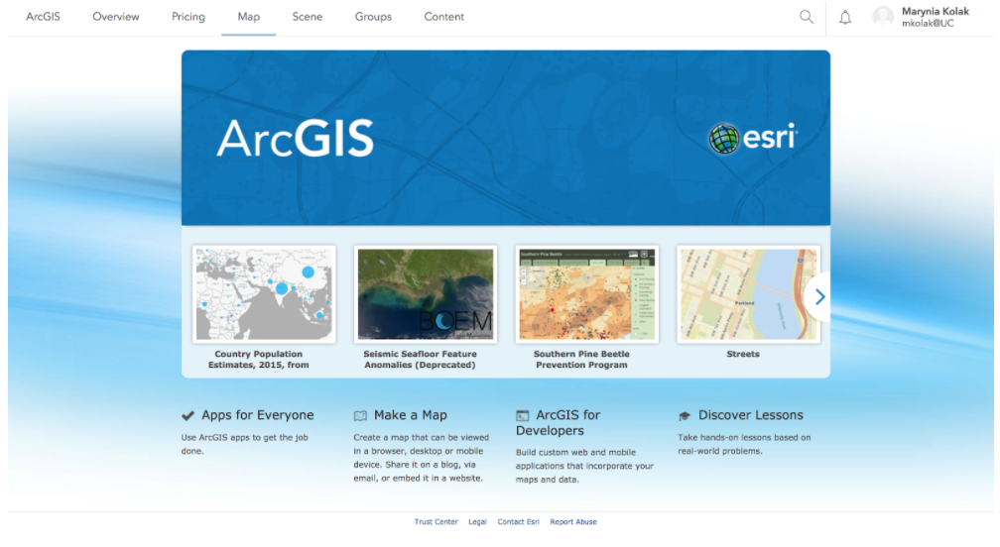
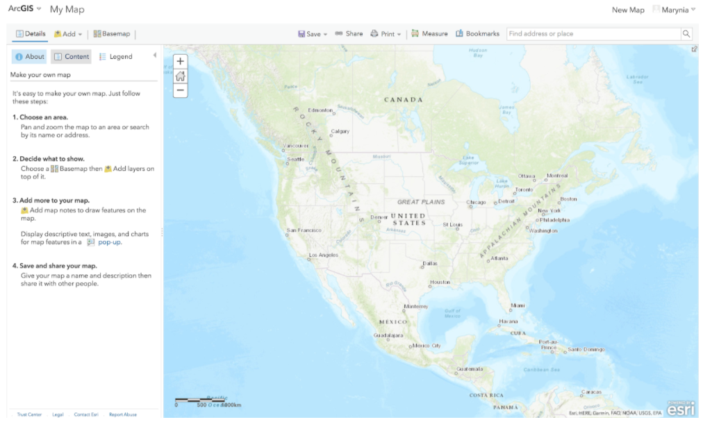
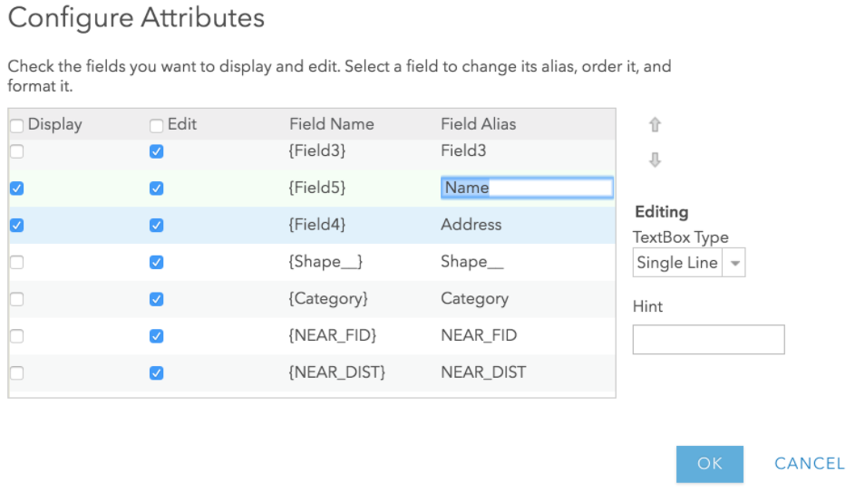
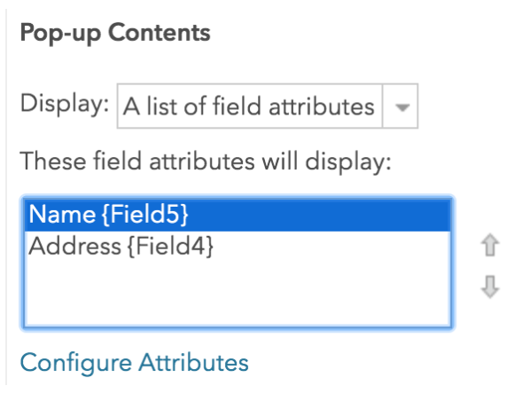
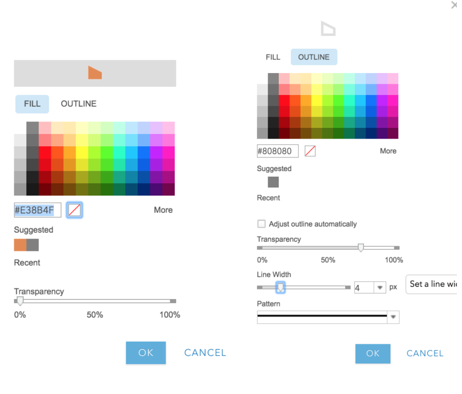
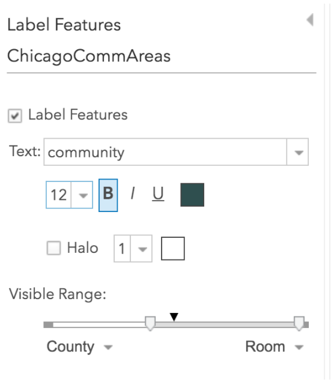
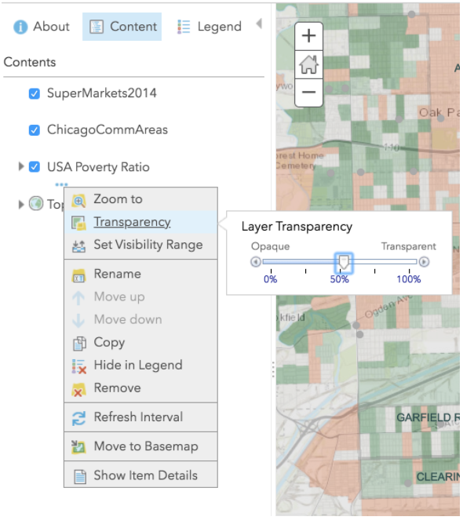
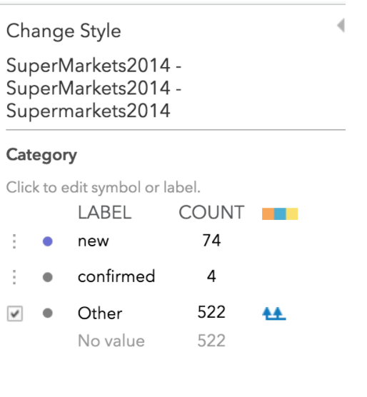

# Lab 7. ESDA & Web Mapping

```{r setup, include=FALSE}
knitr::opts_chunk$set(echo = TRUE)
```

## Overview

In this practical, we will explore the basics of food accessibility using supermarket data in Chicago using a web map in ArcGIS Online. You will plot supermarkets in Chicago in 2014, overlaying community areas and relevant socioeconomic data. Markets that are listed as new will be coded properly and visualized as such to facilitate an exploration of where new supermarkets were placed in Chicago.

## Research Question

## Environment Setup

To set up for this lab, download the zip file of data from the class website (2014 Supermarket point shapefile, Community Area polygon shapefile). Open, unzip, and explore the data using GeoDa or some other local software to familiarize yourself with the data and its properties. 

Next, [register](https://www.esri.com/en-us/arcgis/products/create-account) for a public account of ArcGIS online. 

ArcGIS Online is a cloud-based mapping and analysis solution. Use it to make maps, analyze data, and to share and collaborate. Get access to workflow-specific apps, maps and data from around the globe, and tools for being mobile in the field. Your data and maps are stored in a secure and private infrastructure and can be configured to meet your mapping and IT requirements. [[ref]](https://doc.arcgis.com/en/arcgis-online/get-started/what-is-agol.htm)

We will use ArcGIS Online to make a webmap of the supermarket data and related information.

## Data

The data comes from a study by Kolak et al (2018), “[Urban foodscape trends: Disparities in healthy food access in Chicago, 2007–2014.](https://www.sciencedirect.com/science/article/abs/pii/S1353829217302009)” Most of data from the study is available in [Data in Brief](https://www.sciencedirect.com/science/article/pii/S2352340918314070), though we will use a slightly rawer format of the 2014 supermarket file. The file includes markets marked as “new” as well as “confirmed.” New markets were new as compared to the 2011 file; they could be actual new locations or simply new to the researchers, so care must be taken in using this data. (In other words, this is a rough and exploratory, not validated and confirmatory, lab dataset!) Confirmed locations were independent stores that were checked on by researchers at the time of data collection to confirm supermarket status.

## Section 1: Food Market Map

### Start Mapping

Once you are signed in to ArcGIS online, you’ll make a new map. <br />  
Click on “Map” in the main tab:<br />   
```{r echo=FALSE}

```

This will take you to a new Map:<br />   
```{r echo=FALSE}

```

Click on the “Add+” button at the top of the left toolbar. Click on Add the .zip folder of the supermarkets. (You can keep the original features when prompted.) <br />  
ArcGIS Online automatically searches for the most optimal way to display the data. In this case, it’s picked up the “Category” column and is visualizing new, confirmed, and “other” markets.<br />  
```{r echo=FALSE}
knitr::include_graphics('7-3.png')
```

We will take this option for now. Click “Done” to complete import. <br />  
Next, under “Supermarkets 2014” in the Content section, click on the Table icon. <br />  
```{r echo=FALSE}
knitr::include_graphics('7-4.png')
```

The attribute table appears below the map. Click “Save,” giving your map a name and tag.

### Data Cleaning
Click on the “Category” heading in the table to get an option for sorting. Choose Ascending. <br />   
```{r echo=FALSE}
knitr::include_graphics('7-5.png')
```

Inspect the data. <br />  
You will see that several fields that show “new” in other columns are not indicated as “new” in this category. We will do some light data cleaning. <br />  
Sort “Field3” and search for the OPEN_NEWLOCATION data. Type in “new” in the Category field for all of these that do not otherwise have “new” listed.<br />   

```{r echo=FALSE}
knitr::include_graphics('7-6.png')
```

Search through remaining fields in the dataset, adding any other “new” stores to the Category. <br />  
Should you zoom to another part of the map by accident, you can always click on the additional options by SuperMarkets 2014 in Contents, and select “Zoom to” to recenter:<br />   

```{r echo=FALSE}
knitr::include_graphics('7-7.png')
```

Click Save. <br />  

### Pop-up Configuration
Next we will configure the pop-up window so we present the best information every time a market is clicked. Click on additional options (three dots icon) of Supermarkets 2014, and select “Configure Pop-Up.” Once in the pop-up configuration screen, select “Configure Attributes.” <br />  
We will de-select all fields to display except Field 4 and Field 5. <br />  
We will type in the Field 5 alias as “Name,” and Field 4 alias as “Address.” Click OK. <br />  

```{r echo=FALSE}

```

Then, move Field 5 before Field 4 in the Pop-Up Contents window, so that the store name is before the address in the pop-up. Click OK. <br />  
```{r echo=FALSE}

```

Click on a market in the map to ensure the pop-up is working correctly. If not, resolve. <br />  
```{r echo=FALSE}
knitr::include_graphics('7-10.png')
```

### Add Community Areas

Next, import the Community Areas shapefile as a new layer. Select the “Location” option for display drawing style. Click OK. <br />  
```{r echo=FALSE}
knitr::include_graphics('7-11.png')
```

In the Content window, drag “Community Areas” under Supermarkets so the overlay properly. <br />  
```{r echo=FALSE}
knitr::include_graphics('7-12.png')
```

Click Save. <br />  
Next, click on the icon showing shapes under your new layer; this will allow you styling options. <br />  
Click on the “Options” button, and then click on “Symbols.” <br />  
```{r echo=FALSE}
knitr::include_graphics('7-13.png')
```

Change the fill to transparent (a white square button with a red line crossing). <br />  
Change the outline to a dark gray color, with a thicker line (you’ll need to unclick “Adjust outline automatically”). Click OK. <br />  
```{r echo=FALSE}

```

Click Done. Save. <br />  
Next, we’ll create labels. Click the “Other Options” icon next to the Community Area, and select “Create Labels.” Select “Community” as the attribute that has the area name. Adjust the size, and make the visible range so that the labels only appear when zooming in to Chicago. Explore your options! Click OK. <br />  
```{r echo=FALSE}

```

Save. <br />  

### Section 1 Questions

1. Explore the map you made. What is the distribution of supermarkets overall in Chicago? Describe the spatial pattern.
2. What is the distribution of new supermarkets in Chicago? What community areas have the most new markets? Describe the spatial pattern.
3. Discuss or interpret your findings overall. What hypothesis might emerge as a driving force behind the spatial patterns observed?

## Section 2. Adding Context

Next, we’ll add some additional data to the map to provide context and further explore the foodscape and interrogate our emerging hypothesis. <br />  
Click “Add+”  and select “Browse Living Atlas Layers.” Search for the variable, “Poverty” and select the first option, “USA Poverty Ratio.” What does this ratio represent? Read about it in the options window before importing to ensure you understand what you are loading. <br />  
```{r echo=FALSE}
knitr::include_graphics('7-16.png')
```

Add to Map, and the adjust the Transparency to make it a little less imposing: <br />  
```{r echo=FALSE}

```

You may need to reduce the transparency of Community Area layer outline to ensure it’s plotting in an aesthetically appealing way. You may also want to remove the Community Area pop-up. <br />  
Next, change the color of the New/Confirmed/Other supermarkets to plot in a more pleasing way with the poverty ratio map. I chose a dark purple for new stores, and dark gray for regular. If you can’t find the “Change Style” selection option, explore the icons or investigate further until finding! <br />  
```{r echo=FALSE}

```

Save. <br />  
Next, add another piece of data. You can either import another Living Atlas layer from ArcGIS Online, or some of your own data. For example, you can merge other Community Area data from the Chicago Data Portal, and reload your community area file. Save. <br />  
Final, share your map. Zoom to the desired configuration. Click on “Share,” enable public sharing, and save your link. <br />  

### Section 2 Questions

4. What spatial patterns and distributions emerged when adding the poverty ratio map? How did your hypothesis get further refined, or change?
5. What new data source did you add, and why? How did your hypothesis get further refined, or change?
6. **Post to the Lab 7 Discussion board the following**: a link to your final map, and short description of the patterns uncovered and your final hypothesis that was developed through this exercise. 


